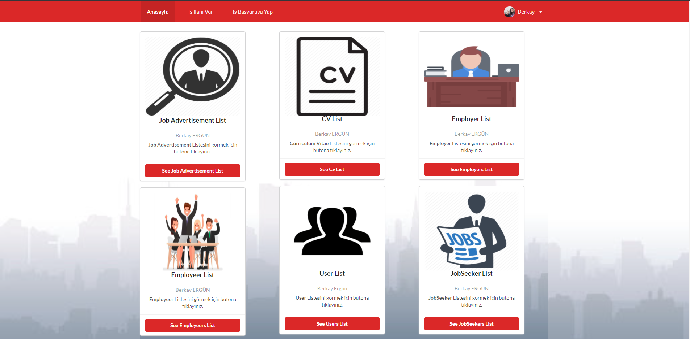
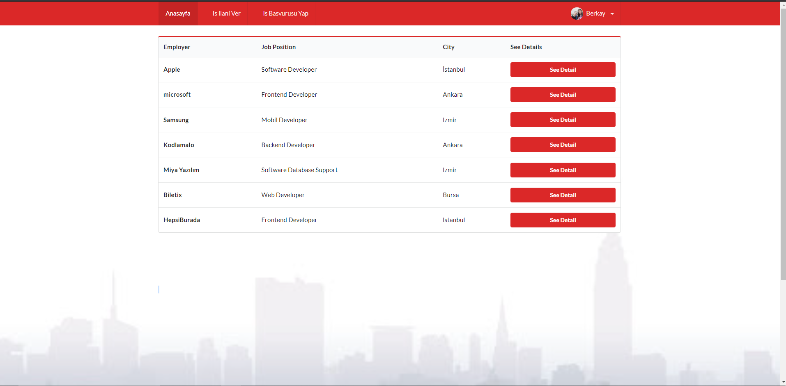
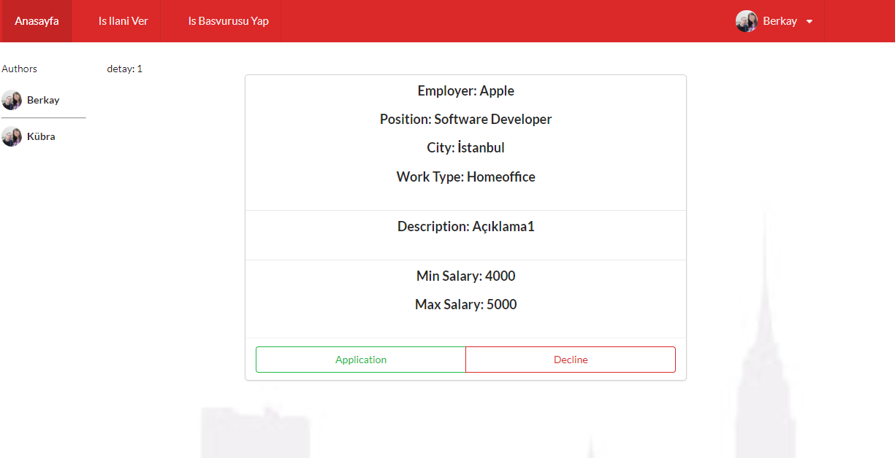
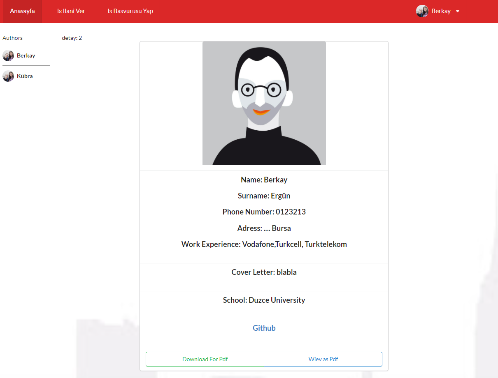

# React-Frontend-HRMS

I use json data in backend.(hrms.json file)

You can adding job advertisement and you make job application 

Your job applications, are approved by hrms staffs 

18.06.2021 updated. 

Dinamic Cv Details page added. 

Dinamic Company Details page added. 

</img>
</img>
</img>
</img>
</img>

