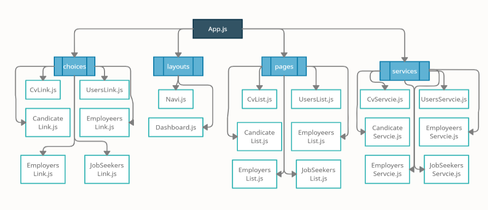

# React-Frontend-HRMS

I use json data in backend.(hrms.json file)

You can adding job advertisement and you make job application 

Your job applications, are approved by hrms staffs 

</img>
</img>
</img>
